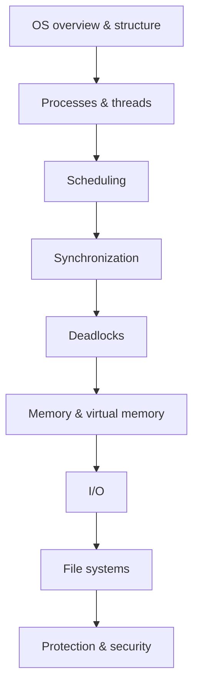

## Module direction

**CS2043 develops the ability to explain how an operating system manages processes, memory, I/O, and files, and to trace and solve the classic OS mechanisms and problems (scheduling, synchronization, deadlocks, and virtual memory).**

> **Source hierarchy:** Current lectures, LMS material, and issued assessment instructions define the delivered course. The official module descriptor and weekly plan define the structure. Supporting notes are used only for clarification and genuine gap filling.
> 

## Module snapshot

| Field | Details |
| --- | --- |
| Module | CS2043 – Operating Systems |
| Semester / credits | Semester 3 / 3 credits |
| Classification | Compulsory, GPA module |
| Contact hours per week | 2 lecture hours + 2 lab/tutorial hours |
| Prerequisite / corequisite | CS1033 |
| Evaluation | Continuous assessment 40% + written examination 60% |

## Operating-systems roadmap

The dependency story to keep in mind:

- Process + thread concepts are needed before scheduling.
- Scheduling + shared-state behaviour lead naturally to synchronization.
- Synchronization failures and resource competition lead to deadlocks.
- Memory management and virtual memory connect OS policy to hardware constraints.
- I/O and file systems connect devices and persistent storage to programs.
- Protection/security sits across everything (users, resources, isolation).

## Learning outcomes

After completing this module, I should be able to:

1. Illustrate the concepts underlying the design and implementation of contemporary operating systems.
2. Define, discuss, and explain policies for scheduling, deadlocks, synchronization, system calls, memory management, and file systems.
3. Develop system programs that simulate operating-system behaviour.
4. Discuss with fellow students the design of new operating-system components.
5. Explain how operating systems interact with computer hardware and apply OS concepts to practical problems.

## Syllabus and lecture map

The **official syllabus headings** are the main structure. The smaller items below them come from the reference-note topic list and will be used to clarify concepts or fill genuine gaps. Lecture pages stay beneath the main topic they belong to.

### 1. History and Overview of Operating Systems

**Reference-note coverage:** Introduction

### 2. Operating System Design and Structure

**Reference-note coverage:** Kernel · Design · Services · System Boot Procedure

**Focus:** OS purpose and services, kernel role, user mode and kernel mode, system calls, OS structures, and the boot flow.

### 3. Processes and Thread Management

**Reference-note coverage:** Process · IPC · Thread · Amdahl's Law · Implicit Threading · Threading Issues

**Focus:** Trace process states, context switching, process creation, communication, and how threads execute inside a process.

### 4. Process and Thread Scheduling

**Reference-note coverage:** CPU Scheduling · Multiple Processor Scheduling · Real-Time CPU Scheduling

**Focus:** Trace scheduling decisions and calculate waiting time, turnaround time, response time, throughput, and CPU utilization.

### 5. Synchronization Tools and Examples

**Reference-note coverage:** Synchronization · Mutual Exclusion · Dekker's Algorithm · Critical Section Problem · Peterson's Algorithm · Lock · Semaphore · Monitor · Liveness

**Focus:** Trace interleavings and explain race conditions, critical-section requirements, synchronization mechanisms, and liveness problems.

### 6. Deadlocks

**Reference-note coverage:** Deadlock · Banker's Algorithm

**Focus:** Distinguish prevention, avoidance, detection, and recovery; draw resource-allocation relationships and trace the safety algorithm.

### 7. Memory Management

**Reference-note coverage:** Main Memory · Virtual Memory

**Focus:** Trace address translation, allocation, paging, segmentation, page replacement, and virtual-memory behaviour.

### 8. I/O Management

**Reference-note coverage:** I/O System · Interrupt-Driven I/O

**Focus:** Connect devices, controllers, interrupts, drivers, buffering, and OS–hardware interaction.

### 9. File Systems

**Reference-note coverage:** Mass Storage Systems · Disk Attachment · HDD Scheduling · RAID

**Gap to watch:** File concepts such as files, directories, allocation, free-space management, and file-system implementation are not visible as separate topics in the supplied reference-note index.

### 10. Protection and Security

**Reference-note coverage:** No dedicated topic is visible in the supplied reference-note index.

**Gap to watch:** Protection domains, access control, authentication, threats, and OS security mechanisms must be covered from lectures and other approved resources.

## Assessment map

| Assessment | Weight | Status |
| --- | --- | --- |
| Continuous assessment | 40% | Confirm components (labs/quizzes/assignments) from current LMS |
| End-semester written examination | 60% | Primary exam |

## Study workflow for this module

1. **Preview:** write questions before reading explanations.
2. **Attempt:** trace a mechanism or solve a problem without notes.
3. **Repair:** use lecture material first; fill only real gaps.
4. **Connect:** link the topic to the OS roadmap (what depends on what).
5. **Practise:** produce an output—trace, calculation, diagram, or short system program.
6. **Recall:** answer key questions from memory.
7. **Review:** mark 🔴 / 🟡 / 🟢 and record misconceptions.

> **Attempt first. AI second.**
> 

## Module-level trackers

### Concept and gap tracker

| Topic | Current state | Main gap | Next evidence |
| --- | --- | --- | --- |
| Week 01 — History and overview | 🔴 Not reviewed | Add the delivered lecture material and attempt recall | Explain OS goals, kernel role, and system-call idea without notes |

### Practice bank

- **Conceptual:** explain policies and trade-offs (why this mechanism exists).
- **Algorithmic/tracing:** scheduling decisions, interleavings, deadlock checks, paging, and I/O flows.
- **Calculation:** CPU scheduling metrics, Banker's algorithm safety, page replacement, disk scheduling.
- **Implementation:** small simulations/system programs where required.

### Recall bank

Each weekly page should include:

1. Basic definitions
2. Why/how understanding
3. Apply to a new scenario
4. Exam-style synthesis

## Compendium and gap list

- Keep the handwritten compendium as the main evolving knowledge source.
- Record only genuine missing explanations, corrected misconceptions, important diagrams, and useful examples here.
- Freeze a page once it is useful; improve it naturally when later lectures expose a real gap.

## Practice

- Trace processes, threads, interrupts, synchronization, memory translation, and I/O flows step by step.
- Solve scheduling, Banker's algorithm, page-replacement, disk-scheduling, and related calculation problems.
- Attempt before checking help; identify the failure point, repair it, and attempt again.
- Include short system-programming or simulation work when required by the lectures or labs.

## Active recall

- Write questions during lectures instead of copying everything verbatim.
- After the lecture, answer from memory before checking notes.
- Add 1–3 reasoning questions per topic, plus one compact exam-answer summary after understanding and practice.
- Use the weekly 🔴 / 🟡 / 🟢 status to decide what needs repair.

## Resources

- Lecture slides and lecturer-provided material are the primary source.
- Sahithyan's Operating Systems notes are a supporting source for clarification and genuine gap filling.
- Add tutorial sheets, lab work, textbook sections, diagrams, and past-paper questions when they are provided.

## Review method

For every compendium or weekly page, check:

- **Accuracy:** Is each statement technically correct?
- **Gaps:** Is any exam-important idea genuinely missing?
- **Connections:** Does the page connect software behaviour to OS mechanisms and hardware?
- **Practice:** Can the mechanism be traced, calculated, programmed, or explained?
- **Recall:** Can I answer the main questions without looking?
