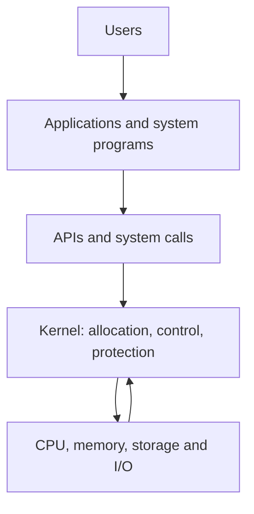
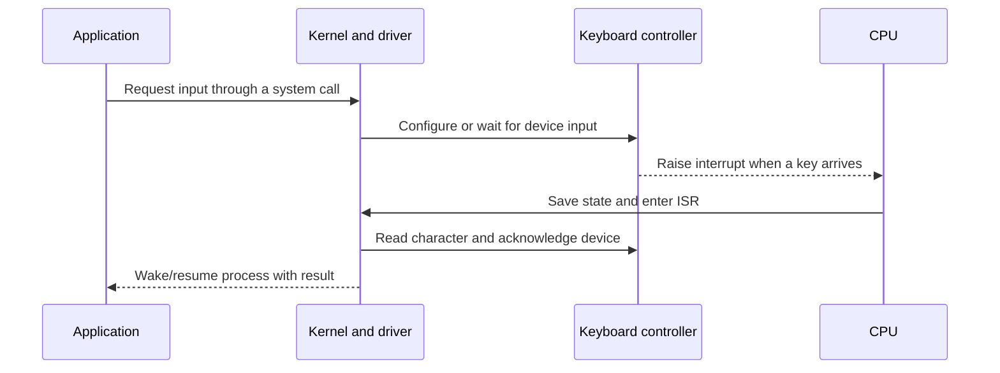
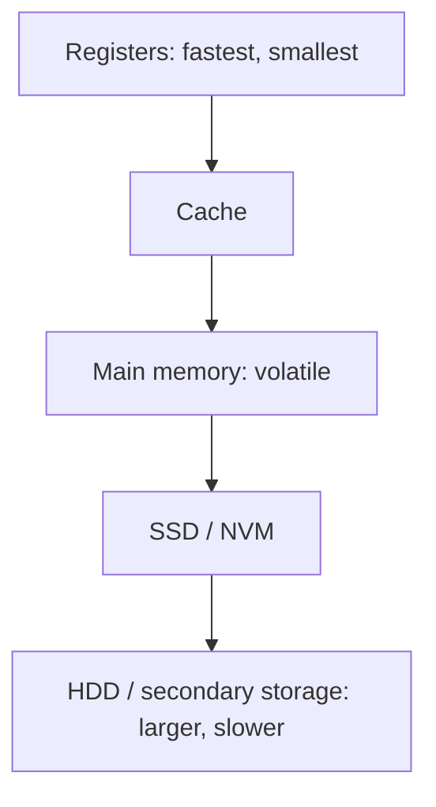
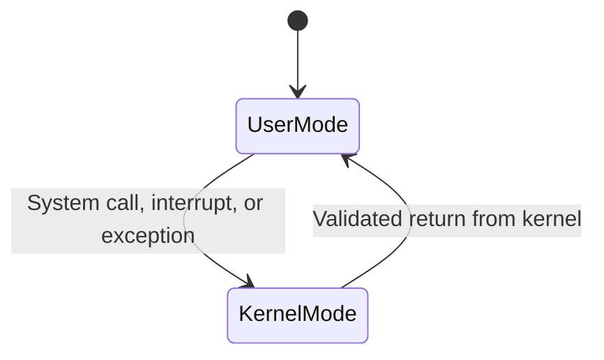
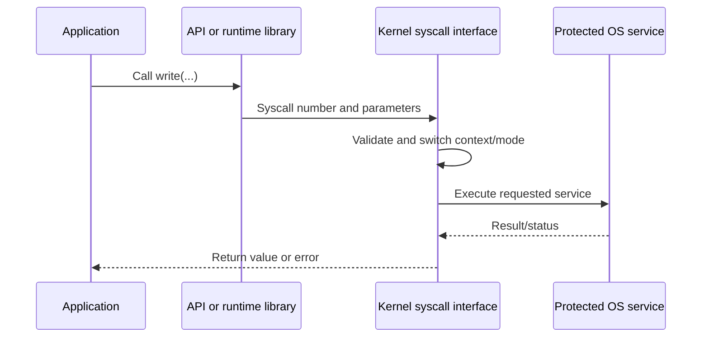
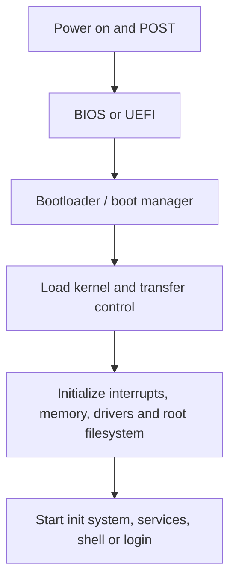

## Week identity and scope

- **Week:** 01
- **Lecture:** 01
- **Date:** 1 July 2026
- **Official syllabus area:** History and Overview of Operating Systems
- **Lecture base:** Chapter 1 - Introduction
- **Assigned preparation:** Chapter 2 - Operating-System Services
- **Practical preparation:** Pintos installation and interactive shell
- **Status:** 🔴 Not reviewed / 🟡 Repairing / 🟢 Understood

> **Boundary:** Chapter 1 is the lecture base for this week. Chapter 2 is preparation for the following class. Pintos material is practical work. Supporting notes may clarify a genuine gap but must not redefine the lecture scope.
> 

## Completion criteria - what “done” means

By the end of this week, I should be able to:

- [ ]  explain why an OS is needed using **abstraction, resource allocation, and control/protection**;
- [ ]  distinguish **OS, kernel, system program, application, and middleware**;
- [ ]  draw the computer-system layers from user to hardware;
- [ ]  trace interrupt-driven I/O and explain the roles of the controller, driver, interrupt vector, and ISR;
- [ ]  explain DMA and the storage hierarchy;
- [ ]  distinguish multiprogramming, multitasking, concurrency, and parallelism;
- [ ]  explain user mode, kernel mode, privileged instructions, and timer protection;
- [ ]  identify the main OS management responsibilities and computing environments;
- [ ]  explain OS services, APIs, system calls, linkers, loaders, policy, and mechanism;
- [ ]  compare monolithic, layered, microkernel, modular, and hybrid structures;
- [ ]  trace the boot sequence from power-on to user space;
- [ ]  install/boot Pintos or record the exact technical blocker;
- [ ]  explain why the Pintos kernel shell cannot rely on normal user-space library behaviour.

## Resources and source priority

### 1. Required lecture sources

- [ ]  **Chapter 1 - Introduction** slides
- [ ]  **Week 1 Moodle page** and activities
- [ ]  Chapter 1 lecture video
- [ ]  Supplied OS market-share images

### 2. Required preparation

- [ ]  **Chapter 2 - Operating-System Services** slides

### 3. Practical sources

- [ ]  **OS Prerequisite - Installing Pintos OS**
- [ ]  **Pintos Installation.txt** - use only the route appropriate to the current host platform
- [ ]  **Interactive Shell for Pintos OS**
- [ ]  **Writing Your Own Operating System** - supplementary concept reading

### 4. Gap-filling references

- Sahithyan - Introduction
- Sahithyan - Kernel
- Sahithyan - Design
- Sahithyan - Services
- Sahithyan - System Boot Procedure

## Preview questions

Answer briefly before reading. Return after studying and repair only what changed.

1. Why should applications not control hardware directly?
2. Is the kernel the complete operating system?
3. How does a slow device obtain CPU attention without constant polling?
4. What stops a user program from keeping the CPU forever?
5. How does an application request a protected kernel service?
6. What happens between pressing the power button and reaching a login screen?

## Concept map

The OS creates a safe and convenient execution environment. Applications see abstractions such as files and processes; the kernel manages the hardware mechanisms underneath them.

# Part A - Lecture 1 core

## 1. Why an operating system is needed

### Definition

An **operating system (OS)** is software that acts as an intermediary between users/applications and computer hardware.

### Three essential roles

1. **Abstraction provider** - offers processes, files, virtual memory, sockets, and other manageable concepts instead of raw hardware details.
2. **Resource allocator** - decides how CPU time, memory, devices, and storage are shared.
3. **Control and protection program** - supervises execution, handles errors, and restricts unsafe or unauthorized access.

### Example

Three applications request CPU time and two try to write to the same storage device. Direct hardware access would cause conflicts. The OS schedules CPU use, protects memory, queues I/O requests, and reports results through controlled interfaces.

### Common trap

**Convenience and efficiency are not opposites.** A general-purpose OS must provide a useful interface while managing finite resources efficiently and safely.

## 2. OS boundary: kernel and surrounding software

| Term | Meaning | Example |
| --- | --- | --- |
| Kernel | Privileged core that manages hardware and protected resources. | Linux kernel, Windows NT kernel |
| System program/service | Supports the operating environment but normally runs outside the kernel. | Shell, service manager, file utility |
| Application | Solves a user problem using OS services. | Browser, editor, database client |
| Middleware | Provides additional frameworks/services above the base OS. | Graphics, multimedia, database framework |

**Key relationship:** the kernel is part of the OS, but the wider operating environment can include system programs, interfaces, and middleware.

## 3. Computer-system organization

A computer system contains:

1. **Hardware** - CPU, main memory, device controllers, and I/O devices.
2. **Operating system** - coordinates and controls hardware use.
3. **Applications** - use OS abstractions and services.
4. **Users** - people, machines, or other systems.

### Controller versus driver

- A **device controller** is hardware that manages a device type and normally contains a local buffer.
- A **device driver** is OS software that knows how to communicate with that controller.
- The CPU and controllers communicate through shared interconnects and memory.

### Lecturer-level checkpoint

The driver is not the physical device. The controller is not the OS. The driver translates OS requests into controller-specific operations.

## 4. Interrupt-driven I/O

### Core distinction

- **Hardware interrupt:** raised by a device or hardware timer.
- **Exception/trap:** generated by the current instruction because of an error or an intentional request such as a system call.

### Worked trace - keyboard input

### Interrupt-handling steps

1. The CPU safely pauses the current execution.
2. Hardware uses the **interrupt vector** to locate the correct interrupt service routine.
3. The OS saves essential CPU state, including registers and the program counter.
4. The ISR identifies and services the event.
5. The OS restores an appropriate saved context and continues execution.

### Why interrupts matter

Without interrupts, the CPU would waste cycles repeatedly checking slow devices. Interrupts allow computation and device activity to overlap.

## 5. I/O behaviour and DMA

- **Blocking/synchronous I/O:** the requesting process waits for completion.
- **Non-blocking/asynchronous I/O:** the process continues and completion is reported later.
- **DMA:** a device controller transfers a block directly between its buffer and main memory after CPU setup. The CPU receives roughly one interrupt per block instead of handling every byte.

### Example

Transferring a 4 KiB disk block byte-by-byte would require excessive CPU participation. DMA allows the controller to move the block, then interrupt the CPU when the block is ready.

## 6. Storage hierarchy and caching

Higher levels are faster and more expensive per unit; lower levels are slower but larger and persistent.

**Caching** keeps recently or frequently used information in faster storage. Because the cache is smaller than its source, replacement policy and consistency matter.

- $1\,\mathrm{KiB}=2^{10}\text{ bytes}$
- $1\,\mathrm{MiB}=2^{20}\text{ bytes}$
- $1\,\mathrm{GiB}=2^{30}\text{ bytes}$

The slides use KB/MB/GB in the common binary sense. KiB/MiB/GiB are the precise binary-unit names.

## 7. Multiprogramming, multitasking, concurrency, and parallelism

| Concept | Meaning | Primary goal |
| --- | --- | --- |
| Multiprogramming | Several jobs remain in memory; another runs when one waits. | Keep the CPU utilized. |
| Multitasking/time-sharing | The CPU switches frequently among interactive processes. | Good user response. |
| Concurrency | Multiple tasks make progress over overlapping time. | Structure and responsiveness. |
| Parallelism | Multiple tasks execute simultaneously on different processing units. | Higher throughput/speed. |

### Example

On one core, music playback and typing can be concurrent because the OS rapidly switches work and reacts to interrupts. They are parallel only if execution truly overlaps on separate cores or processing units.

## 8. Dual-mode protection and timer control

- **User mode:** restricted execution for applications.
- **Kernel mode:** privileged execution for the OS core.
- **Privileged instruction:** allowed only in kernel mode, such as configuring certain hardware controls.

A user process cannot legitimately set itself to kernel mode. A hardware-controlled event enters an approved kernel entry point.

### Why the timer is essential

Before allowing a user process to run, the OS programs a timer. When the countdown reaches zero, a hardware interrupt returns control to the kernel. This prevents an infinite loop from permanently taking the CPU.

## 9. Main OS management responsibilities

| Area | Representative responsibilities |
| --- | --- |
| Processes | Create/delete, schedule, synchronize, communicate, handle deadlocks. |
| Memory | Track use, allocate/deallocate, decide what remains in memory. |
| Files | Create/delete, organize directories, map files to storage, control access. |
| Mass storage | Allocation, free space, partitions, mounting, disk scheduling. |
| I/O | Drivers, buffering, caching, spooling, uniform device interface. |
| Protection/security | Controlled access, authentication, isolation, defence from threats. |

## 10. Computer architectures and environments

### Architectures

- **Single processor:** one general-purpose CPU, possibly with special-purpose processors.
- **Multiprocessor/multicore:** multiple processors or cores increase throughput and can improve reliability.
- **Symmetric multiprocessing (SMP):** processors perform the same kinds of tasks under one OS.
- **Asymmetric multiprocessing:** processors receive specialised roles.
- **NUMA:** memory access time depends on which processor owns or is closest to the memory region.
- **Clustered system:** separate machines cooperate, often for availability or high performance.

### Environments

- Traditional, mobile, client-server, peer-to-peer, cloud, distributed, and real-time embedded systems.
- **Virtualization:** guest OS and host normally target the same CPU architecture; a VMM provides virtual hardware.
- **Emulation:** imitates a different architecture and is generally slower.

### Market-share image interpretation

The supplied June 2025 and May 2026 snapshots show that mobile and desktop OS families coexist. This supports the lecture point that OS design depends on the environment. The charts do **not** by themselves rank technical quality, and differences can come from real usage changes or measurement/classification changes.

## 11. Supporting Chapter 1 concepts - know, but do not over-expand yet

- **Open-source operating systems:** source availability allows code-level study and experimentation.
- **Kernel data structures:** linked lists, balanced trees, hash maps, queues, and bitmaps support efficient resource tracking.
- **Connection to earlier CSE work:** DSA structures reappear inside schedulers, memory managers, caches, and file systems.

# Part B - Chapter 2 assigned preparation

## 12. Operating-system services

### Services mainly helping users/programs

- user interface;
- program execution;
- I/O operations;
- file-system manipulation;
- communication;
- error detection.

### Services mainly supporting efficient system operation

- resource allocation;
- logging/accounting;
- protection and security.

### Interface types

- **CLI:** accepts textual commands through a command interpreter or shell.
- **GUI:** uses windows, icons, menus, and pointer-based interaction.
- **Touch/voice interface:** uses gestures, virtual keyboards, and voice commands.
- **Batch interface:** receives prepared jobs with little direct interaction.

## 13. API, system call, and ABI

### Single authoritative relationship

- **API:** source-level programmer interface, such as POSIX or Win32.
- **System call:** controlled request that crosses into the kernel.
- **ABI:** binary-level contract covering calling conventions, registers, executable format, data layout, and OS/architecture expectations.

Not every library/API function makes a system call. For example, a pure string calculation can remain entirely in user space.

### System-call categories

Process control, file management, device management, information maintenance, communication, and protection.

### Parameter passing

Parameters can be placed in registers, in a memory block referenced by a register, or on a stack. The kernel must validate all user-provided addresses and values.

## 14. Compiler, linker, loader, and execution

- The **compiler** translates source into object code.
- The **linker** combines object files and libraries into an executable.
- The **loader** places the executable in memory, performs necessary relocation/linking work, and begins execution.
- Dynamic libraries can be loaded and shared at runtime.

Applications are OS-specific because APIs, ABIs, system calls, executable formats, and conventions differ.

## 15. Policy versus mechanism

- **Policy:** what should be done?
- **Mechanism:** how the decision is implemented.

Examples:

| Area | Policy | Mechanism |
| --- | --- | --- |
| CPU | Which process runs next? | Timer and context-switch routine. |
| Memory | Which page should be replaced? | Page tables and replacement hooks. |
| Disk | Which request should be served first? | Driver queues and controller commands. |

Separating policy from mechanism increases flexibility: the decision rule can change without replacing the low-level capability.

## 16. OS structural approaches

| Structure | Core idea | Advantage | Cost/risk |
| --- | --- | --- | --- |
| Monolithic | Most services execute in kernel space. | Fast direct calls. | Large privileged failure surface. |
| Layered | Each layer uses lower-layer services. | Clear abstraction and organisation. | Rigid boundaries or extra overhead. |
| Microkernel | Only essentials stay in kernel; services move to user space. | Isolation, security, maintainability. | IPC and context-switch overhead. |
| Modular | Kernel modules load through defined interfaces. | Flexible runtime extension. | Loaded modules remain privileged. |
| Hybrid | Combines approaches. | Practical balance. | Architectural complexity. |

## 17. Building and booting an OS

### Build overview

Write source → configure for the target hardware → compile → link/build kernel and modules → install → boot and test.

### Boot trace

**Do not collapse firmware and bootloader into the same concept:** firmware discovers/initializes hardware and locates a boot path; the bootloader locates/loads the selected kernel.

## 18. Debugging and performance tools

- **Log:** recorded events, warnings, and errors.
- **Core dump:** snapshot of a failed user process.
- **Crash dump:** kernel/system state after an OS failure.
- **Tracing:** records selected runtime events; examples include `strace`, `gdb`, `perf`, and `tcpdump`.
- **Profiling:** samples execution to locate performance hotspots.
- **Performance tuning:** identifies and removes bottlenecks.

# Part C - Pintos practical path

## 19. Why Pintos is used

Pintos is a simplified teaching OS for 32-bit x86. It exposes kernel threads, user programs, virtual memory, and file-system components in a codebase suitable for undergraduate modification. QEMU provides the target machine through emulation.

### Setup checkpoints

- [ ]  Clone/obtain the required Pintos distribution.
- [ ]  Verify the correct target compiler, assembler, linker, and debugger.
- [ ]  Install and verify QEMU.
- [ ]  Build Pintos utilities and configure `PATH`.
- [ ]  Build the threads project.
- [ ]  Run Pintos and confirm the expected boot-complete output.

### Practical caution

The provided setup documents contain platform-specific and older instructions. Do not combine Ubuntu, macOS/Apple Silicon, and Windows/VM steps into one procedure. Select one host route and record the exact command, full error, host OS, architecture, and current directory when blocked.

## 20. Interactive kernel shell

The exercise adds a very small shell that runs when Pintos receives no test command-line arguments.

Required commands:

- `whoami` - display the required identity output;
- `time` - display seconds since the Unix epoch;
- `thread` - display thread statistics;
- `exit` - leave the interactive shell.

Files worth inspecting:

- `threads/init.c`
- `devices/input.c`
- `lib/stdio.c`
- `lib/kernel/console.c`

### Key conceptual lesson

This is a **kernel-level shell**. Normal user-space library functions may depend on system calls and a user-space runtime that do not exist in this context. Use Pintos-provided kernel routines or implement the required behaviour.

## Questions from the lecture activities

- **Does every processor need an OS?** No. A processor can execute bare-metal firmware. An OS becomes valuable when the system needs abstraction, sharing, protection, concurrency, or complex program management.
- **How do users and hardware interact?** Follow the Concept Map and Sections 3, 4, and 13; the path is application → API/system call → kernel/driver → controller/device.
- **Why might a compiled application fail on another OS?** See Section 13 and Section 14: APIs, ABIs, system calls, and executable formats differ.
- **Why did the market-share percentages change?** The images alone cannot establish causation. Real usage, sample composition, categories, or measurement methods may change.

## High-value practice

### Trace 1 - infinite loop protection

A user process enters an infinite loop. Explain:

1. who programmed the timer;
2. what event occurs when the timer expires;
3. why the process cannot disable the timer;
4. how the kernel can schedule another process.

### Trace 2 - keyboard input

Without looking at Section 4, reproduce this path and explain every transition:

`application -> system call -> kernel/driver -> controller -> interrupt -> ISR -> ready/running process`

### Compare 1 - kernel structures

Compare monolithic and microkernel designs using performance, failure isolation, security, maintainability, and communication overhead.

### Produce 1 - Pintos shell

- [ ]  Locate the shell insertion point.
- [ ]  Trace one existing Pintos console/input function before writing code.
- [ ]  Implement one command at a time.
- [ ]  Test normal input, unknown commands, empty input, and exit behaviour.
- [ ]  Explain which parts execute in kernel mode.

## Misconception repair table

| Misconception | Correct understanding | Recheck |
| --- | --- | --- |
| OS and kernel are always identical. | The kernel is the privileged core; the wider OS can include system programs and interfaces. | □ |
| All control transfers are hardware interrupts. | Devices/timers raise interrupts; executing software causes exceptions/traps and intentional system calls. | □ |
| Concurrency means parallel execution. | Concurrency is overlapping progress; parallelism is simultaneous execution. | □ |
| Every API call enters the kernel. | Only operations needing protected OS service require a system call. | □ |
| User code can switch itself into kernel mode. | Hardware transfers control only through validated kernel entry mechanisms. | □ |
| Firmware, bootloader, and kernel are the same program. | They are distinct stages with different responsibilities. | □ |
| A kernel shell can use ordinary user-space libraries normally. | Kernel code uses kernel-safe routines and cannot assume user-space services exist. | □ |

## Exam-ready compression

### Explain an operating system

Definition → three roles → major managed resources → protection → one practical example.

### Explain interrupt-driven I/O

Device/controller event → interrupt → save context → interrupt vector/ISR → service/acknowledge → restore or schedule.

### Explain dual-mode operation

User restrictions → kernel privileges → controlled entry → privileged instructions → timer guarantees OS control.

### Explain a system call

Application/API → syscall number and parameters → mode transition → validation → kernel service → return value/error.

### Compare OS structures

Location of services → communication method → performance → failure isolation/security → maintainability.

## Active recall - answer without notes

1. Why does abstraction improve both programmability and protection?
2. Trace an interrupt from a keyboard controller to the resumption of a process.
3. Why are user mode and a timer both necessary for CPU protection?
4. Give an example where tasks are concurrent but not parallel.
5. Distinguish API, system call, and ABI using one application example.
6. Explain the difference between firmware, bootloader, kernel initialization, and the init system.
7. Why is a microkernel usually easier to isolate but potentially slower than a monolithic kernel?
8. Why can Pintos kernel code not assume that standard user-space functions are available?

## One-paragraph summary

An operating system creates a controlled execution environment between applications and hardware. It provides abstractions, allocates CPU/memory/storage/devices, handles interrupts and I/O, and protects resources through user/kernel modes and privileged instructions. Multiprogramming and time-sharing keep the system useful and responsive, while multicore systems can also provide true parallelism. Applications obtain protected services through APIs and system calls. OS structure determines which services remain privileged and how components communicate. During boot, firmware locates a boot path, the bootloader loads the kernel, the kernel initializes hardware-facing and resource-management subsystems, and the first user-space process starts services. Pintos turns these ideas into code that can be built, booted, traced, and modified.

## Weekly repair and review

- [ ]  Answered the preview questions again and marked changed understanding
- [ ]  Drew the concept map from memory
- [ ]  Completed both execution traces
- [ ]  Completed Chapter 2 preparation
- [ ]  Compared OS structures without looking at the table
- [ ]  Installed/booted Pintos or documented the precise blocker
- [ ]  Attempted one interactive-shell command
- [ ]  Repaired only genuine gaps in the handwritten compendium
- [ ]  Set the final status to 🔴 / 🟡 / 🟢
